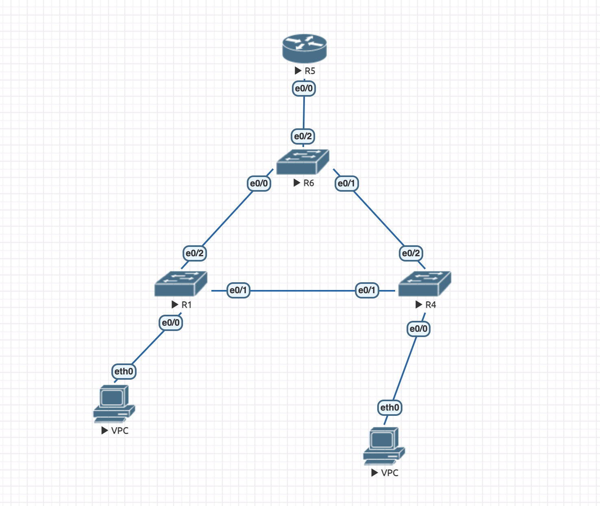
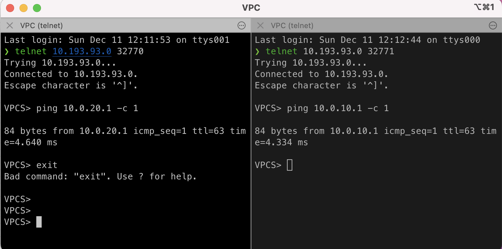

VPC(2) left
```
ip 10.0.10.1/24 10.0.10.2

save
```

VPC(2) right
```
ip 10.0.20.1/24 10.0.20.2

save
```

R6 port 32774
```
Switch#show spanning-tree

VLAN0001
  Spanning tree enabled protocol ieee
  Root ID    Priority    32769
             Address     aabb.cc00.6000
             This bridge is the root
             Hello Time   2 sec  Max Age 20 sec  Forward Delay 15 sec

  Bridge ID  Priority    32769  (priority 32768 sys-id-ext 1)
             Address     aabb.cc00.6000
             Hello Time   2 sec  Max Age 20 sec  Forward Delay 15 sec
             Aging Time  300 sec

Interface           Role Sts Cost      Prio.Nbr Type
------------------- ---- --- --------- -------- --------------------------------
Et0/3               Desg FWD 100       128.4    Shr


VLAN0010
  Spanning tree enabled protocol ieee
  Root ID    Priority    24586
             Address     aabb.cc00.6000
             This bridge is the root
             Hello Time   2 sec  Max Age 20 sec  Forward Delay 15 sec

  Bridge ID  Priority    24586  (priority 24576 sys-id-ext 10)
             Address     aabb.cc00.6000
             Hello Time   2 sec  Max Age 20 sec  Forward Delay 15 sec
             Aging Time  15  sec

Interface           Role Sts Cost      Prio.Nbr Type
------------------- ---- --- --------- -------- --------------------------------
Et0/0               Desg LRN 100       128.1    Shr
Et0/1               Desg LRN 100       128.2    Shr
Et0/2               Desg LRN 100       128.3    Shr


VLAN0020
  Spanning tree enabled protocol ieee
  Root ID    Priority    24596
             Address     aabb.cc00.6000
             This bridge is the root
             Hello Time   2 sec  Max Age 20 sec  Forward Delay 15 sec

  Bridge ID  Priority    24596  (priority 24576 sys-id-ext 20)
             Address     aabb.cc00.6000
             Hello Time   2 sec  Max Age 20 sec  Forward Delay 15 sec
             Aging Time  300 sec

Interface           Role Sts Cost      Prio.Nbr Type
------------------- ---- --- --------- -------- --------------------------------
Et0/0               Desg LRN 100       128.1    Shr
Et0/1               Desg LRN 100       128.2    Shr
Et0/2               Desg LRN 100       128.3    Shr
```
```
enable
conf t
vlan 10
vlan 20
exit

spanning-tree vlan 10 root primary
spanning-tree vlan 20 root primary

interface e0/0
switchport trunk allowed vlan 10,20
switchport trunk encapsulation dot1q
switchport mode trunk
exit
interface e0/1
switchport trunk allowed vlan 10,20
switchport trunk encapsulation dot1q
switchport mode trunk
exit
interface e0/2
switchport trunk allowed vlan 10,20
switchport trunk encapsulation dot1q
switchport mode trunk
exit
exit
wr
copy running-config startup-config
```

R1 port 32769
```
enable
conf t
vlan 10
vlan 20
exit

interface e0/1
switchport trunk allowed vlan 10,20
switchport trunk encapsulation dot1q
switchport mode trunk
exit
interface e0/2
switchport trunk allowed vlan 10,20
switchport trunk encapsulation dot1q
switchport mode trunk
exit
interface e0/0
switch mode access
switch access vlan 10
exit
exit
wr
copy running-config startup-config
```

R4 port 32772
```
enable
conf t
vlan 10
vlan 20
exit

interface e0/1
switchport trunk allowed vlan 10,20
switchport trunk encapsulation dot1q
switchport mode trunk
exit
interface e0/2
switchport trunk allowed vlan 10,20
switchport trunk encapsulation dot1q
switchport mode trunk
exit
interface e0/0
switch mode access
switch access vlan 20
exit
exit
wr
copy running-config startup-config
```

R5 port 32773
```
Router>show ip route
Codes: L - local, C - connected, S - static, R - RIP, M - mobile, B - BGP
       D - EIGRP, EX - EIGRP external, O - OSPF, IA - OSPF inter area
       N1 - OSPF NSSA external type 1, N2 - OSPF NSSA external type 2
       E1 - OSPF external type 1, E2 - OSPF external type 2
       i - IS-IS, su - IS-IS summary, L1 - IS-IS level-1, L2 - IS-IS level-2
       ia - IS-IS inter area, * - candidate default, U - per-user static route
       o - ODR, P - periodic downloaded static route, H - NHRP, l - LISP
       a - application route
       + - replicated route, % - next hop override

Gateway of last resort is not set

      10.0.0.0/8 is variably subnetted, 4 subnets, 2 masks
C        10.0.10.0/24 is directly connected, Ethernet0/0.10
L        10.0.10.2/32 is directly connected, Ethernet0/0.10
C        10.0.20.0/24 is directly connected, Ethernet0/0.20
L        10.0.20.2/32 is directly connected, Ethernet0/0.20
```
```
enable
conf t
interface e0/0
no shutdown
interface e0/0.10
encapsulation dot1q 10   
ip address 10.0.10.2 255.255.255.0
exit
interface e0/0
no shutdown
interface e0/0.20
encapsulation dot1q 20   
ip address 10.0.20.2 255.255.255.0
exit
do write
exit
wr
copy running-config startup-config
```
### Ping ###

