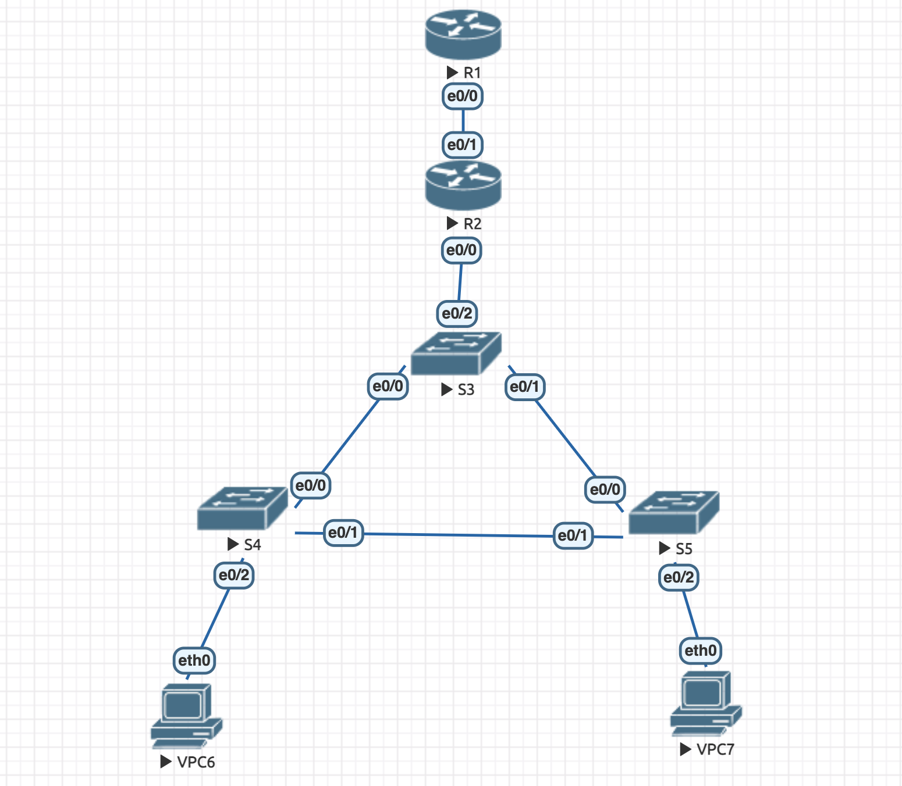
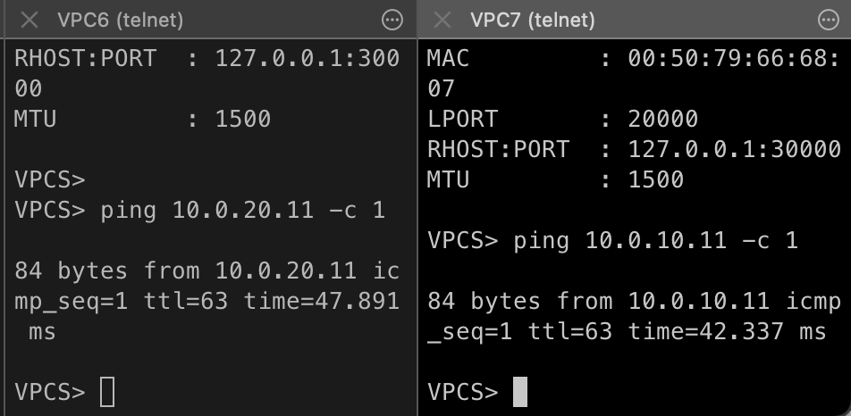

Switch-ы настроены как в предыдущей дз.

VPC6 
```
VPCS> ip dhcp
DDORA IP 10.0.10.11/24 GW 10.0.10.1
VPCS> show ip

NAME        : VPCS[1]
IP/MASK     : 10.0.10.11/24
GATEWAY     : 10.0.10.1
DNS         : 8.8.8.8
DHCP SERVER : 10.0.10.1
DHCP LEASE  : 86315, 86400/43200/75600
MAC         : 00:50:79:66:68:06
LPORT       : 20000
RHOST:PORT  : 127.0.0.1:30000
MTU         : 1500
```

VPC7
```
VPCS> ip dhcp
DDORA IP 10.0.20.11/24 GW 10.0.20.1

VPCS> show ip

NAME        : VPCS[1]
IP/MASK     : 10.0.20.11/24
GATEWAY     : 10.0.20.1
DNS         : 8.8.8.8
DHCP SERVER : 10.0.20.1
DHCP LEASE  : 86392, 86400/43200/75600
MAC         : 00:50:79:66:68:07
LPORT       : 20000
RHOST:PORT  : 127.0.0.1:30000
MTU         : 1500
```

R2 
```
enable
conf t

interface e0/0
no shutdown
interface e0/0.10
encapsulation dot1q 10   
ip address 10.0.10.1 255.255.255.0
exit
interface e0/0.20
encapsulation dot1q 20   
ip address 10.0.20.1 255.255.255.0
exit
do write

ip dhcp pool TenVlanPool
network 10.0.10.0 255.255.255.0
default-router 10.0.10.1
dns-server 8.8.8.8
exit
ip dhcp excluded-address 10.0.10.1 10.0.10.10

ip dhcp pool TwentyVlanPool
network 10.0.20.0 255.255.255.0
default-router 10.0.20.1
dns-server 8.8.8.8
exit
ip dhcp excluded-address 10.0.20.1 10.0.20.10

interface e0/0
ip nat inside
exit
interface e0/0.10
ip nat inside
exit
interface e0/0.20
ip nat inside
exit
interface e0/1
ip address 10.0.0.5 255.255.255.0
no shutdown
ip nat outside
exit

ip nat pool POOL 10.0.0.5 10.0.0.255 netmask 255.255.255.0
access-list 10 permit 10.0.10.0 0.0.0.255
access-list 10 permit 10.0.20.0 0.0.0.255
ip nat inside source list 10 pool POOL

exit
```

R1
```
enable
configure terminal 
interface e0/0
no shutdown
ip address 10.0.0.1 255.255.255.0
exit
```

## Ping ##
