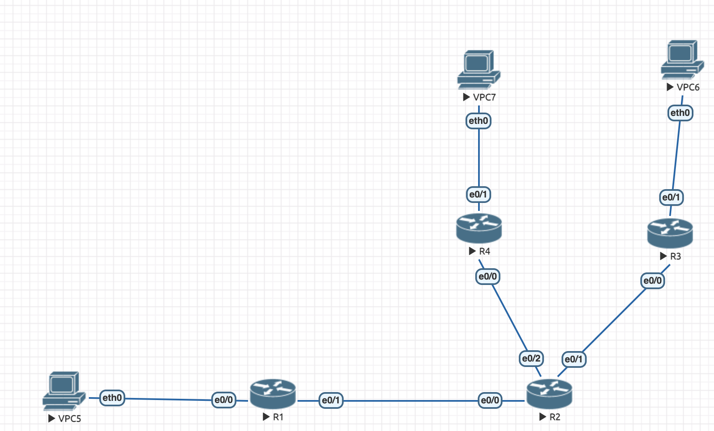
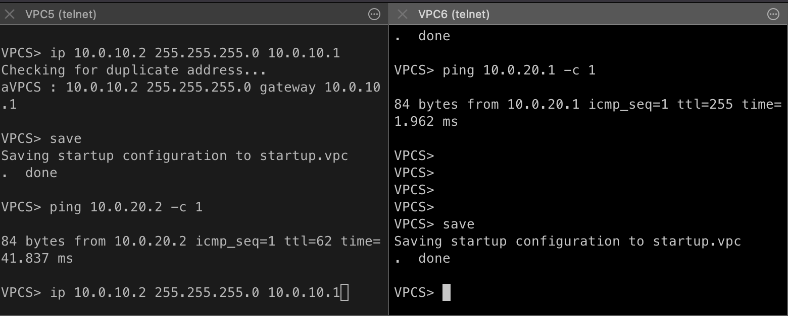

VPC5
```
ip 10.0.30.1/24 10.0.30.2
```

VPC6
```
ip 10.0.10.1/24 10.0.10.2
```

VPC7
```
ip 10.0.20.1/24 10.0.20.2
```

R1
```
enable
conf t
interface e0/0
no shutdown
ip address 10.0.10.1 255.255.255.0
exit
interface e0/1
ip address 1.1.10.2 255.255.255.0
no shutdown
exit
interface 100tunnel
ip address 172.16.10.1 255.255.255.0
ip mtu 1400
ip tcp adjust-mss 1360
tunnel source 1.1.10.2
tunnel destination 1.1.20.2
exit
ip route 0.0.0.0 0.0.0.0 1.1.10.1
ip route 10.0.20.2 255.255.255.255 172.16.10.2

interface 200tunnel
ip address 172.16.11.1 255.255.255.0
ip mtu 1400
ip tcp adjust-mss 1360
tunnel source 1.1.10.2
tunnel destination 1.1.30.2
exit

crypto isakmp policy 1
encr 3des
hash md5
authentication pre-share
group 2
lifetime 86400
exit
crypto isakmp key merionet address 1.1.30.2
crypto ipsec transform-set TS esp-3des esp-md5-hmac
mode transport
exit
crypto ipsec profile protect-gre
set security-association lifetime seconds 86400
set transform-set TS
exit
interface 200tunnel
tunnel protection ipsec profile protect-gre
exit
```

R2
```
enable
conf t
interface e0/0
no shutdown
ip address 1.1.10.1 255.255.255.0
exit
interface e0/1
ip address 1.1.20.1 255.255.255.0
no shutdown
exit
```

R3
```
enable
conf t
interface e0/0
no shutdown
ip address 1.1.20.2 255.255.255.0
interface e0/1
no shutdown
ip address 10.0.20.1 255.255.255.0
exit
interface 100tunnel
ip address 172.16.10.2 255.255.255.0
ip mtu 1400
ip tcp adjust-mss 1360
tunnel source 1.1.20.2
tunnel destination 1.1.10.2
exit
ip route 0.0.0.0 0.0.0.0 1.1.20.1
ip route 10.0.10.2 255.255.255.255 172.16.10.1
exit
```

R4
```
enable
conf t
interface e0/0
no shutdown
ip address 1.1.30.2 255.255.255.0
exit
interface e0/1
no shutdown
ip address 10.0.30.1 255.255.255.0
exit
interface 200tunnel
ip address 172.16.11.2 255.255.255.0
ip mtu 1400
ip tcp adjust-mss 1360
tunnel source 1.1.30.2
tunnel destination 1.1.10.2
exit
ip route 0.0.0.0 0.0.0.0 1.1.30.1
exit
ip route 10.0.10.2 255.255.255.255 172.16.11.1

crypto isakmp policy 1
encr 3des
hash md5
authentication pre-share
group 2
lifetime 86400
exit
crypto isakmp key merionet address 1.1.10.2
crypto ipsec transform-set TS esp-3des esp-md5-hmac
mode transport
exit
crypto ipsec profile protect-gre
set security-association lifetime seconds 86400
set transform-set TS
exit
interface Tunnel 200
tunnel protection ipsec profile protect-gre
exit
exit
```

## Ping ##

